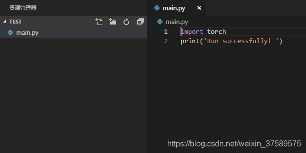
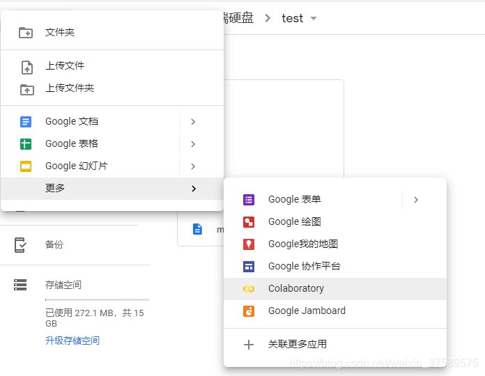
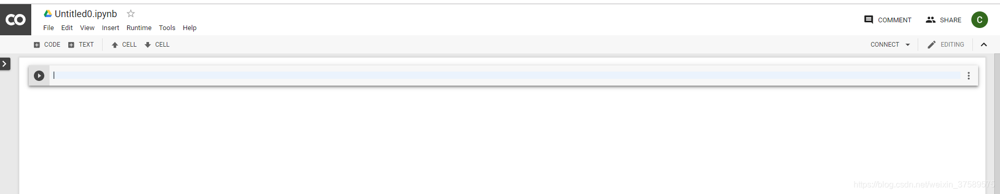
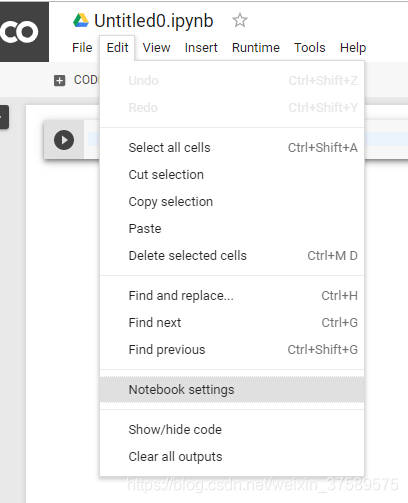
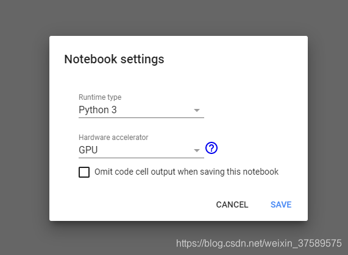
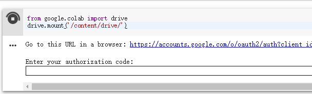
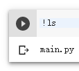

# 準備工作
- 谷歌序列，所以先去註冊一個谷歌帳號
- 用自己的谷歌帳號使用 google driver 
- 自己的專案在本地通過調試，放在一個資料夾裡面（包含資料集，最好是中文名稱）
# 步驟
進入 google driver : https://drive.google.com

右鍵上傳專案所在的資料夾：


！ [在這裡插入圖片描述]（https：/img-blog.csdnimg.cn/20190703225625905.png


我這裡簡單地上傳了一個名為test的資料夾，裡面只有一個 main.py 的檔，代碼也很簡單，但是可以簡單測試 Pytorch的使用。
# 進入 colab：點擊左上角“新建”—->“更多”-->“Colaboratory”


# "Edit" --> " Notebook settings" -->


這裡我選擇的 Python3 （根據自己代碼依賴的環境） 和 GPU，如果要用 GPU 這一步必須調整好。 每次調整這裡的設置，後面的步驟都要再次進行。 所以推薦這裏設置好


# 代碼段裡面輸入
```

  from google.colab import drive 
  drive.mount ('/content/drive/')

```
然後點擊左側的運行圖示，或者 Ctrl + Enter 運行。 這時候會出現



點擊 URL 進入，授權 Google 使用者，然後複製授權碼粘貼到輸入框，Enter。 這個時候回顯示掛載成功
```
!ls
```
.

成功搞定~


